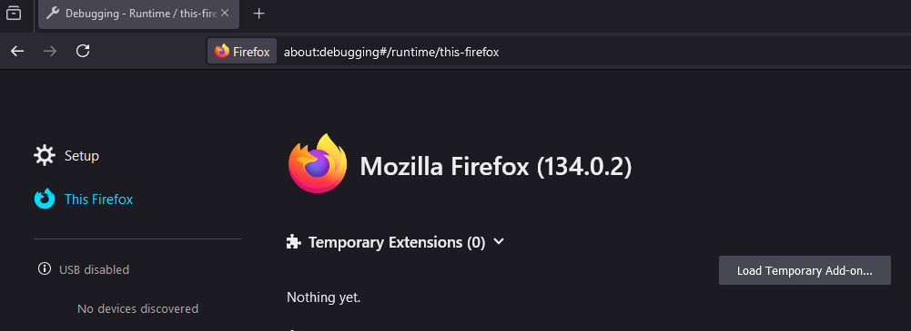

# Firefox Extension Base Template

This is a reusable Firefox extension template using Manifest V3.

## Features

- Extension Popup
- Options page
  - Dark Mode
  - Options Reset
  - Context Menu Toggle
- Context menu integration
- Persistent storage
- Multi Language support through `_locales` with `en` default

## Installation

1. Clone the repo
2. Load the `src` folder as an "Unpacked Extension" in `about:debugging` -> This Firefox



## Build

1. `npm run build` will clean and build the dist folder

## Chrome

The property `background.service_worker` has been included in `manifest.json` to support Chrome. This causes a warning in Firefox. On Feb 1st 2025 this warning could be safely ignored.

```
Reading manifest: Warning processing background.service_worker: An unexpected property was found in the WebExtension manifest.
```
